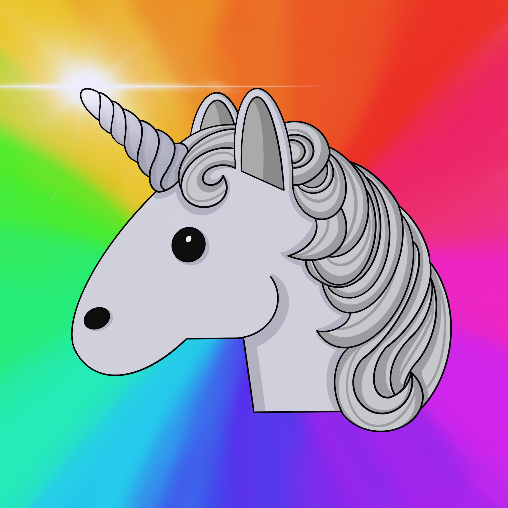
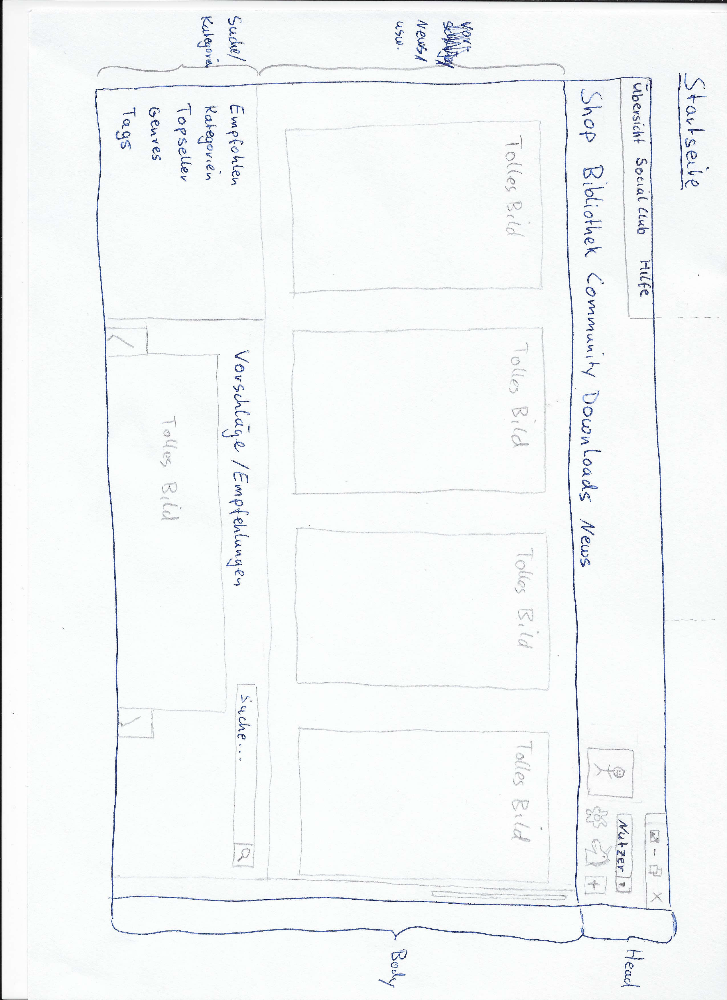
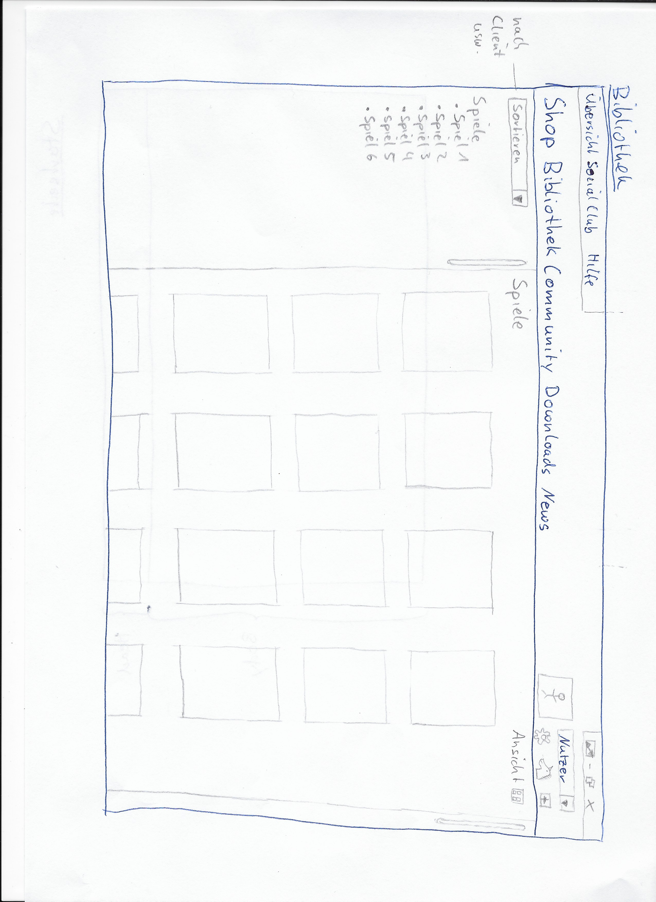
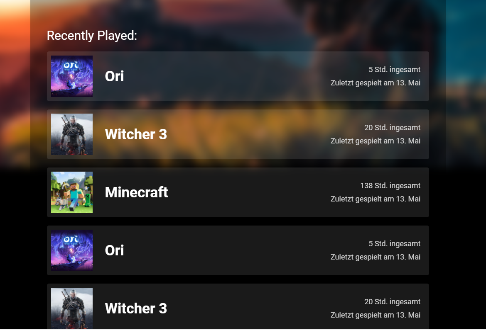

 

  

  <h2 align="center">UniVerse - Client for Gaming-Clients</h2>
  <h2 align="center"> Readme zum Projekt  </h2>
  <h3 align="center">Gruppe 8</h3>
  

  Alana Wolter  
  Dominic Holey  
  Timur Öz  
  Mike Kanik  
  Daniel Schüürmann  
  

     
    <a href="https://www.youtube.com/watch?v=dQw4w9WgXcQ"><strong>View Video</strong></a>
    ·
    <a href="https://gitlab.beuth-hochschule.de/s80356/universe"><strong>View Repo</strong></a>
    ·
    <a href="https://univerrse.atlassian.net/jira/software/projects/UN/boards/1/backlog"><strong>View Issues</strong></a>
  

  
Inhalt

  <ol>
    <li>
      <a href="#einführung">Einführung</a>
      <ul>
        <li><a href="#entwickelt-mit">Entwickelt mit</a></li>
      </ul>
    </li>
    <li>
      <a href="#screenshots-universe">Screenshots UniVerse</a>
      <ul>
        <li><a href="#konzept">Konzept</a></li>
        <li><a href="#umsetzung">Umsetzung</a></li>
        <li><a href="#use-case">Use Case</a></li>
        <li><a href="#roadmap">Roadmap</a></li>
        <li><a href="#tools">Tools</a></li>
      </ul>
    </li>
    <li><a href="#links">Links</a></li>

  </ol>

<!-- ABOUT THE PROJECT -->
## Einführung

[![Product Name Screen Shot][product-screenshot]](https://example.com)

UniVerse ist ein "globaler" lokaler Client für Gaming Clients. Unsere Idee ist es, aufgrund der Vielzahl an verschiedenen Gaming Clients, eine globale Lösung zu entwickeln. Also einen Client der **alle** lokal installieren Spiele findet und auflistet. Nahezu jeder große Publisher verwendet einen eigenen Gaming Client für die Verwaltung der Spiele/Anwendungen, was sehr schnell unübersichtlich wird.   Im Rahmen dieses Projekts haben wir die Anwendung für die Clients *Steam* und *Uplay* etwickelt. Durch die Angabe der Speicherverzeichnisse des Clients, werden die installierten Spiele in einer Bibliothek aufgelistet. Der Nutzer kann nachdem er sich eingeloggt/registriert hat, ein bestimmtes Spiel auswählen und starten. Außerdem wird die Bibliothek nach verhandenen Clients unterteilt. Des Weiteren bietet UniVerse die möglichkeit eine individuelle Nutzerseite zu gestalten und ein eigenes Bild hochzuladen und die zuletzt gespielten Spile inkl. Zeit zu sehen.

Warum UniVerse?
* Es gibt bisher keine/wenige wirklich gute Lösungen um die vielen verschiedenen Clients miteinander zu verbinden 
* Durch die vielen verschiedenen Clients wird es erschwert Anwendungen zu finden 
  * z.B. Steam, Uplay, Origin, GoG, Epic Games, BattleNet
* Ein übergeordneter Client, der die jeweiligen Client API's anspricht erleichtert die Verwaltung der Anwendungen extrem

A list of commonly used resources that I find helpful are listed in the acknowledgements.

## Entwickelt mit

* [Jira](https://www.atlassian.com/)
* [Gitlab](https://www.gitlab.com/)
* [Mern Stack](https://bit.ly/3z3hjW3)
* [Electron](https://www.electronjs.org)

## Screenshots UniVerse

### Konzept

Startseite
 

Bibliothek
 

### Umsetzung

Startseite
 

Bibliothek
 

Startseite
 

Bibliothek
 

## Use Case

Ein Nutzer möchte eine bestimmte Anwendung aus einem (Gaming) Client starten. Durch die mittlerweile große Zahl an verschiedenen Clients, z.B. Steam, Uplay, Origin, EpicGames usw. muss der Nutzer unter Umständen lange suchen bis er die Anwendung findet. Das kostet Zeit und Nerven. __UniVerse__ bietet dem Nutzer eine bequeme clientunabhängige Übersicht über die lokal installierten Anwendungen unabhängig vom Client. Der Nutzer kann in einer großzügigen Bibliothek bequem navigieren, Anwendungen starten, sein eigenes Profil anpassen, einen alternativen Farbmodus aktivieren. 

## Roadmap

Zum aktuellen Stand (16.07.2021) können mit UniVerse spiele der Clients Steam und Uplay, nach auswahl der Pfade, dargestellt und verwaltet werden. Denkbar wären einige Erweiterung für weitere Clients, eine soziale Komponente, ein Ranking-System, ein Trophäen-System verschiedene Sortierungsfunktionen uvm. Die Anwendung ist funktionsbereit und erleichtert die Suche jetzt schon extrem.

## Links

* [Scrum-Board](https://www.atlassian.com/)

* [Gitlab](https://gitlab.beuth-hochschule.de/s80356/universe)

* [Deployment](https://www.atlassian.com/)

<!-- ACKNOWLEDGEMENTS -->
## Tools
* [NodeJS](https://nodejs.org/en/about/)
* [MongoDB](https://www.mongodb.com/de-de)
* [ReactJS](https://reactjs.org)
* [ExpressJS](https://expressjs.com/de/)
* [ElectronJS](https://www.electronjs.org)
* [YouTube](https://kenwheeler.github.io/slick)
* [Videotool](https://github.com/cferdinandi/smooth-scroll)
